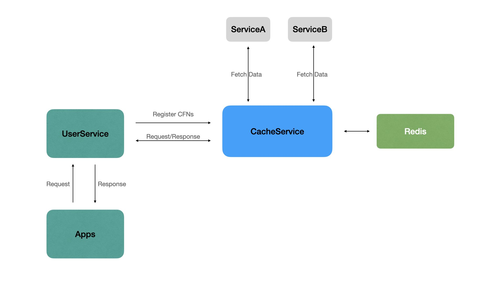

# CacheService(缓存服务)

一个基于`redis`的缓存服务。

### Docker

推荐使用docker获取此服务。

> docker pull resynz/cache-service:0.0.1

`docker-compose.yml`文件示例如下：

```yaml
version: '2'
services:
  cache-service:
    image: resynz/cache-service:0.0.1
    network_mode: "bridge"
    ports:
      - "4930:4930"
    command: /bin/cache-service
    volumes:
      - ./data:/data
      - ./configs:/configs
    logging:
      driver: "json-file"
      options:
        max-size: "10m"
        max-file: "2"
```

### 配置信息

在该程序的所在文件夹，创建两个文件夹，分别是`configs`、`data`。

在`configs`中，创建服务的配置信息文件`config.json`。内容如下：

```json
{
  "port": 4930,
  "redis": {
    "host": "172.17.0.1",
    "port": 6379,
    "password": "",
    "db": 1
  }
}
```

`data`文件夹创建好即可，此文件夹由服务维护，用来存放缓存数据的相关信息（`cfn`）。


### 关于Cfn

`cfn`是此服务为每个缓存对象设计的一个结构体，结构如下:

```go
type Fn struct {
	Method string      `form:"method" binding:"required" json:"method"`
	Uri    string      `form:"uri" binding:"required" json:"uri"`
	Param  interface{} `form:"param" binding:"" json:"param,omitempty"`
}

type Cfn struct {
	Name   string `form:"name" binding:"required" json:"name"` // 缓存对象名称
	Expire int64  `form:"expire" binding:"" json:"expire"` // 缓存存活时间 单位 秒
	Fn     *Fn    `form:"fn" binding:"required" json:"fn"` // 当缓存失效时，需要获取缓存数据的地址
}
```

### 流程说明



* 应用级服务（UserService）调用CacheService接口，添加缓存对象CFN。
* CacheService接收到CFN后，调用CFN中的Api信息拿到数据并存入`Redis`，同时将CFN信息记录到服务中（该信息会在内存中存储，当服务停止时记录到本地文件`data/cfn.json`，服务重新启动时会从文件中读取）。
* 当应用（Apps）向UserService索要数据时，UserService直接向CacheService获取数据即可。


### Api说明

CacheService的Api响应数据基础格式如下：

```json
{
  "code": 200,
  "message": "请求成功"
}
```

其中`code`为200时为请求成功，其他值为请求失败，失败原因从`message`中获取。如果接口有实质性数据返回，将会在`data`字段体现。

#### 1. 添加CFN缓存对象

* Url: `/api/cfn`
* Method: `POST`
* Request Body:

```json
{
  "name": "<缓存对象名称>",
  "expire": 60,
  "fn": {
    "method": "get",
    "uri": "<数据源地址>",
    "params": {}
  }
}
```

* Response:

```json
{
  "code": 200,
  "message": "请求成功"
}
```

#### 2. 获取CFN缓存对象

* Url: `/api/cfn/:name`
* Method: `GET`
* Response:

```json
{
  "code": 200,
  "data": {
      "name": "<缓存对象名称>",
  		"expire": 60,
      "fn": {
        "method": "get",
        "uri": "<数据源地址>",
        "params": {}
      }
  },
  "message": "请求成功"
}
```

#### 3. 删除CFN缓存对象

* Url: `/api/cfn/:name`
* Method: `DELETE`
* Response:

```json
{
  "code": 200,
  "message": "请求成功"
}
```

#### 4. 获取缓存数据

* Url: `/api/cache/:name`
* Method: `GET`
* Response:

```json
{
  "code": 200,
  "message": "请求成功",
  "data": "<数据信息>"
}
```

